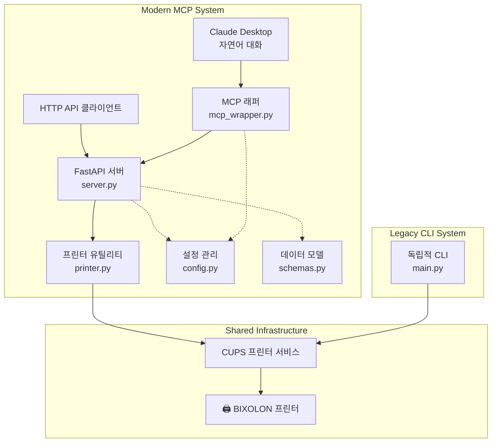
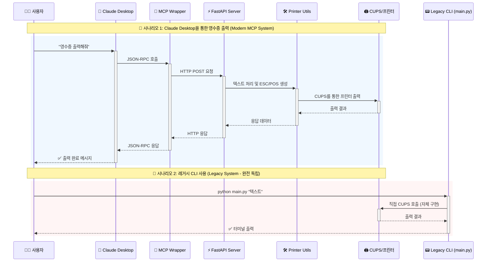
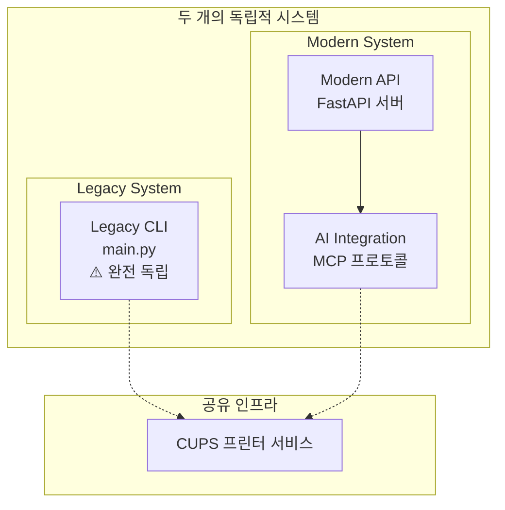
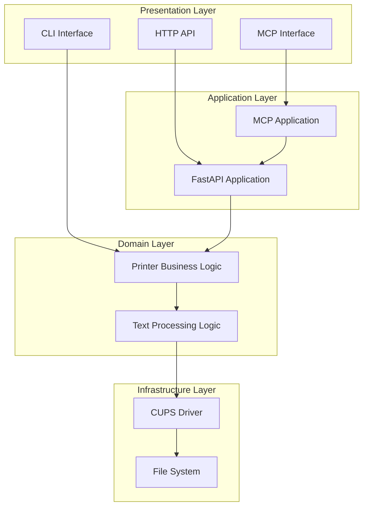
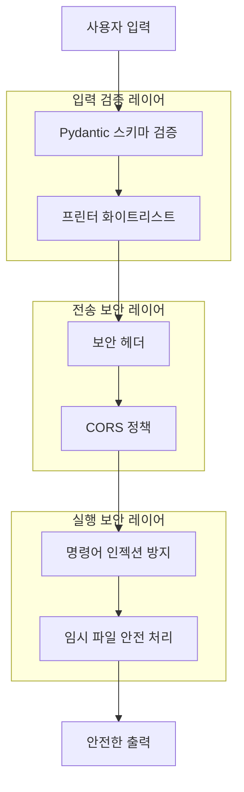

# 영수증 프린터 시스템 아키텍처 개요

## 🎯 시스템 목적

이 시스템은 **BIXOLON 영수증 프린터**를 제어하는 다층 아키텍처로, 한국어 완벽 지원과 현대적인 AI 통합을 목표로 합니다. 레거시 CLI부터 Claude Desktop 통합까지 다양한 사용자 인터페이스를 제공합니다.

## 🏗️ 전체 아키텍처

### 병렬 시스템 구조

### 데이터 플로우

## 🔧 핵심 컴포넌트 분석

### 1. **Legacy CLI (main.py)** ⚠️ **완전 독립 시스템**
- **역할**: 기존 사용자들을 위한 하위 호환성 제공
- **특징**: 
  - **완전 독립적**: 다른 모듈과 의존성 없음
  - **코드 중복**: 모든 함수를 자체적으로 구현
  - **단일 파일**: 스탠드얼론 프로그램
  - **직접 CUPS 호출**: MCP 시스템과 완전 분리
- **사용 시나리오**: 스크립트 자동화, 터미널 사용자, 기존 워크플로우
- **MCP 의존성**: **없음** - 삭제해도 MCP 시스템 정상 동작

### 2. **Core Printer Utils (printer.py)**
- **역할**: 한국어 텍스트 처리 및 ESC/POS 명령어 생성의 핵심 로직
- **특징**: 
  - 한글/영문 혼합 텍스트의 정확한 폭 계산
  - ESC/POS 프로토콜 마스터리
  - 프린터 상태 관리
- **핵심 함수**:
  - `get_text_width()`: 문자 폭 계산
  - `wrap_text()`: 스마트 줄바꿈
  - `create_esc_pos_content()`: ESC/POS 명령어 생성

### 3. **FastAPI Server (server.py)**
- **역할**: 현대적인 REST API 서버
- **특징**:
  - 구조화된 영수증 데이터 처리
  - 보안 기능 (화이트리스트, 입력 검증)
  - 상세한 에러 처리 및 문제 해결 가이드
- **주요 엔드포인트**:
  - `GET /printers`: 프린터 목록
  - `POST /printers/{name}/print`: 영수증 출력
  - `GET /printers/{name}/status`: 프린터 상태

### 4. **MCP Wrapper (mcp_wrapper.py)**
- **역할**: Claude Desktop과 FastAPI 서버 간의 브리지
- **특징**:
  - JSON-RPC 프로토콜 구현
  - HTTP-to-MCP 변환
  - 자연어 인터페이스 지원
- **제공 도구**:
  - `print_receipt`: 영수증 출력
  - `list_printers`: 프린터 목록
  - `preview_receipt`: 미리보기

### 5. **Configuration & Data Models**
- **config.py**: 보안 설정, 프린터 화이트리스트
- **schemas.py**: Pydantic 데이터 모델, 입력 검증

## 🌊 아키텍처 패턴 분석

### 1. **병렬 시스템 아키텍처**

**핵심 아이디어**: 
- **병렬 공존**: 두 시스템이 완전히 독립적으로 동작
- **코드 중복**: 각각 자체적으로 모든 기능 구현
- **인프라 공유**: CUPS 프린터 서비스만 공유

### 2. **레이어드 아키텍처**

### 3. **마이크로서비스 지향 설계**
- **단일 책임**: 각 컴포넌트가 명확한 역할
- **느슨한 결합**: HTTP API를 통한 컴포넌트 간 통신
- **독립적 배포**: 각 서비스를 독립적으로 실행/배포 가능

## 🔒 보안 아키텍처

### 다층 보안 모델

## 🎯 주요 설계 원칙

### 1. **점진적 복잡성 (Progressive Complexity)**
- 단순한 텍스트부터 구조화된 영수증까지 지원
- 사용자가 필요에 따라 복잡도 선택 가능

### 2. **병렬 호환성 (Parallel Compatibility)**
- 레거시 시스템과 현대적 시스템의 **완전 독립적 공존**
- 레거시 사용자의 학습 곡선 **제로** (기존 방식 그대로)

### 3. **확장성 (Extensibility)**
- 새로운 프린터 모델 쉽게 추가 가능
- 다른 프로토콜 (네트워크, 블루투스) 지원 가능

### 4. **관심사 분리 (Separation of Concerns)**
- 텍스트 처리, API 서비스, 프로토콜 변환 각각 독립
- 테스트 가능성과 유지보수성 향상

## 🚀 기술적 혁신 포인트

### 1. **한국어 텍스트 처리 전문성**
- 한글 문자 폭 정확 계산 (2:1 비율)
- 단어 경계 기반 지능적 줄바꿈
- EUC-KR 인코딩 및 ESC/POS 명령어 마스터리

### 2. **AI 통합의 선진성**
- MCP 프로토콜을 통한 Claude Desktop 연동
- 자연어 인터페이스로 기술 진입 장벽 제거
- JSON-RPC ↔ HTTP 변환의 우아한 구현

### 3. **보안 중심 설계**
- 화이트리스트 기반 접근 제어
- 다층 입력 검증
- 명령어 인젝션 방지

## 📈 향후 분석 로드맵

이 아키텍처 개요를 바탕으로 다음 순서로 세부 분석을 진행할 예정:

### 🎯 **MCP 시스템 중심 분석 (main.py 제외)**

1. **📁 Core Printer Utils (printer.py)**
   - 한국어 텍스트 처리 로직
   - ESC/POS 명령어 생성 과정
   - **MCP 시스템의 핵심 엔진**

2. **🌐 FastAPI Server (server.py)**
   - REST API 설계 및 구현
   - 보안 기능 및 에러 처리
   - **MCP 시스템의 백엔드**

3. **🤖 MCP Wrapper (mcp_wrapper.py)**
   - JSON-RPC 프로토콜 구현
   - Claude Desktop 통합 매커니즘
   - **MCP 시스템의 프론트엔드**

4. **📊 Configuration & Schemas**
   - 보안 설정 및 데이터 모델
   - 입력 검증 전략

5. **🧪 Testing Strategy**
   - 다층 테스트 아키텍처
   - 단위/통합/E2E 테스트

### ⚠️ **main.py는 분석 대상에서 제외**
- 완전 독립적인 레거시 시스템
- MCP 시스템 이해에 불필요
- 코드 중복으로 인한 분석 효율성 저하

이 문서는 **MCP 시스템**의 나침반 역할을 하며, 각 컴포넌트의 상세 분석 시 참조 기준이 될 것입니다.