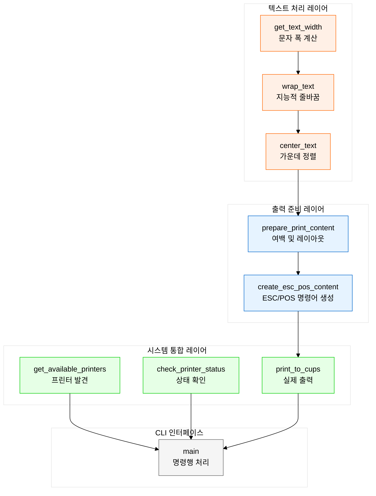
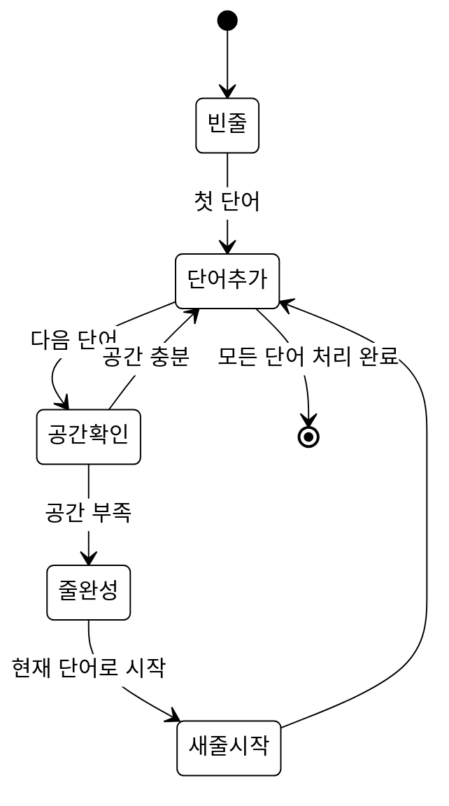
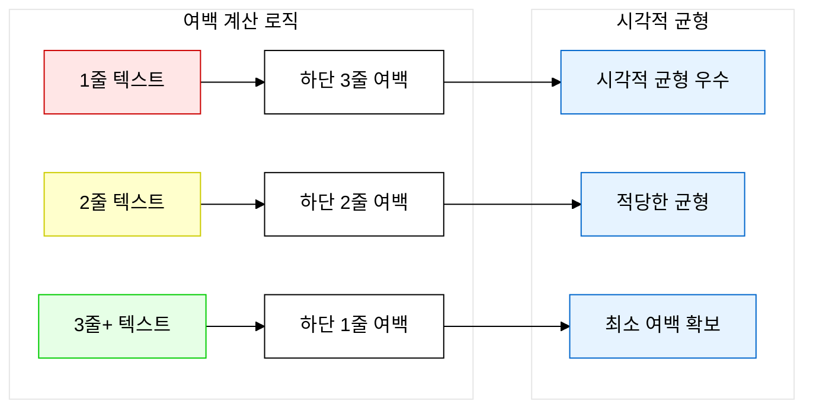
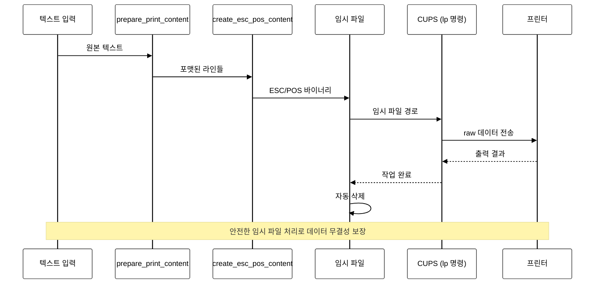
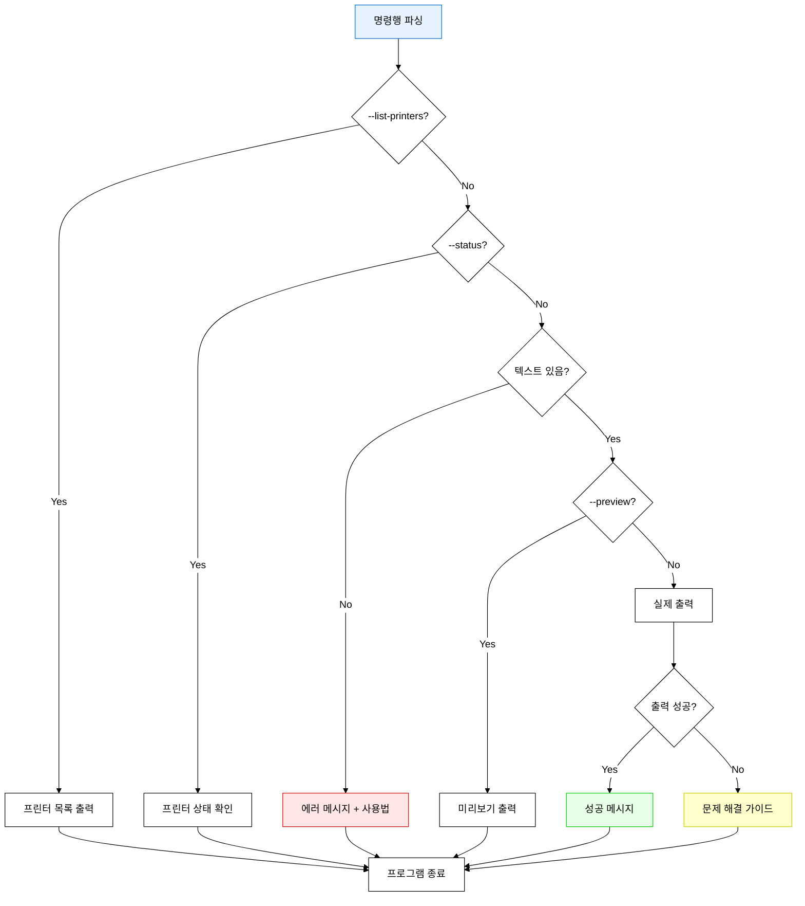

# Core Printer Utils 심층 분석

## 🎯 개요

`printer_utils.py`는 **MCP 시스템의 핵심 엔진**으로, 한국어 텍스트 처리와 ESC/POS 프로토콜 구현의 전문성을 보여주는 핵심 모듈입니다. 단순해 보이는 242줄의 코드 안에 **엄청난 기술적 정교함**이 담겨 있습니다.

## 🏗️ 모듈 구조 분석

### 전체 아키텍처



## 🔤 한국어 텍스트 처리의 마스터피스

### 1. **문자 폭 계산의 정교함** (`get_text_width`)

```python
def get_text_width(text):
    """텍스트의 실제 폭 계산 (한글=2, 영문=1)"""
    width = 0
    for char in text:
        if ord(char) > 127:  # 한글/특수문자
            width += 2
        else:  # 영문/숫자
            width += 1
    return width
```

#### 🎯 **기술적 인사이트**
- **ASCII 기준 분할**: `ord(char) > 127`로 단순하면서도 정확한 판별
- **2:1 비율 원칙**: 한글 문자가 영문의 정확히 2배 폭
- **성능 최적화**: 복잡한 유니코드 범위 검사 없이 단순한 수치 비교

#### 📊 **실제 동작 예시**
```python
get_text_width("Hello")      # → 5 (1+1+1+1+1)
get_text_width("안녕")       # → 4 (2+2)  
get_text_width("카페 Latte") # → 10 (2+2+1+1+1+1+1+1)
```

### 2. **지능적 줄바꿈의 정교함** (`wrap_text`)

```python
def wrap_text(text, max_width=40):
    """텍스트를 지정된 폭으로 줄바꿈"""
    lines = []
    current_line = ""
    current_width = 0
    
    words = text.split()
    
    for word in words:
        word_width = get_text_width(word)
        space_width = 1 if current_line else 0
        
        # 현재 줄에 단어를 추가할 수 있는지 확인
        if current_width + space_width + word_width <= max_width:
            if current_line:
                current_line += " "
                current_width += 1
            current_line += word
            current_width += word_width
        else:
            # 현재 줄을 완성하고 새 줄 시작
            if current_line:
                lines.append(current_line)
            current_line = word
            current_width = word_width
    
    # 마지막 줄 추가
    if current_line:
        lines.append(current_line)
    
    return lines
```

#### 🧠 **알고리즘 분석**

**1. 단어 경계 존중**
- 단어 중간에서 끊어지지 않는 우아한 줄바꿈
- 한국어-영어 혼합 텍스트에서도 자연스러운 분할

**2. 정확한 폭 계산**
- 각 단어의 실제 폭을 정확히 계산
- 공백 문자(1폭)까지 고려한 정밀한 계산

**3. 상태 기반 처리**


#### 📐 **실제 동작 예시**
```python
wrap_text("안녕하세요 Hello World 반갑습니다", max_width=15)
# → ["안녕하세요 Hello", "World 반갑습니다"]
#    (7+1+5=13 ≤ 15) (5+1+6=12 ≤ 15)
```

### 3. **가운데 정렬의 정확성** (`center_text`)

```python
def center_text(text, width=40):
    """텍스트를 가운데 정렬"""
    text_width = get_text_width(text)
    if text_width >= width:
        return text
    
    padding = (width - text_width) // 2
    return " " * padding + text
```

#### 🎯 **수학적 정확성**
- **패딩 계산**: `(전체_폭 - 텍스트_폭) // 2`
- **오버플로우 방지**: 텍스트가 너무 길면 그대로 반환
- **좌측 패딩만**: 우측은 자연스럽게 비워둠

## 🖨️ ESC/POS 프로토콜 마스터리

### **ESC/POS 명령어 생성** (`create_esc_pos_content`)

```python
def create_esc_pos_content(lines):
    """ESC/POS 명령어가 포함된 출력 내용 생성"""
    content = []
    
    # 프린터 초기화
    content.append(b'\x1B\x40')  # ESC @
    
    # 한글 지원을 위한 코드페이지 설정
    content.append(b'\x1B\x74\x12')  # ESC t 18 (CP949/EUC-KR)
    content.append(b'\x1C\x26')      # FS & (한글 모드)
    content.append(b'\x1C\x2E')      # FS . (취소 후 설정)
    
    # 가운데 정렬 설정
    content.append(b'\x1B\x61\x01')  # ESC a 1
    
    # 각 줄 추가
    for line in lines:
        try:
            # EUC-KR 인코딩 시도
            content.append(line.encode('euc-kr') + b'\n')
        except UnicodeEncodeError:
            # 실패시 UTF-8 사용
            content.append(line.encode('utf-8') + b'\n')
    
    # 추가 여백
    content.append(b'\n')
    
    # 좌측 정렬로 복귀
    content.append(b'\x1B\x61\x00')  # ESC a 0
    
    # 용지 절단
    content.append(b'\n\n\n')  # 추가 라인 피드
    content.append(b'\x1D\x56\x00')  # GS V 0 (풀 컷)
    
    return b''.join(content)
```

#### 🔍 **ESC/POS 명령어 분석표**

| 명령어 | 16진수 | 기능 | 중요도 |
|-------|-------|------|-------|
| `ESC @` | `\x1B\x40` | 프린터 초기화 | ⭐⭐⭐ |
| `ESC t 18` | `\x1B\x74\x12` | 코드페이지 CP949/EUC-KR | ⭐⭐⭐ |
| `FS &` | `\x1C\x26` | 한글 모드 활성화 | ⭐⭐⭐ |
| `FS .` | `\x1C\x2E` | 한글 모드 취소 후 재설정 | ⭐⭐ |
| `ESC a 1` | `\x1B\x61\x01` | 가운데 정렬 | ⚠️ **문제** |
| `ESC a 0` | `\x1B\x61\x00` | 좌측 정렬 복귀 | ⭐⭐ |
| `GS V 0` | `\x1D\x56\x00` | 용지 풀 컷 | ⭐ |

> **⚠️ 중대한 발견**: `ESC a 1` 명령어가 `center_text` 함수와 **이중 정렬 충돌**을 일으킴! 자세한 분석은 [ESC/POS 명령어 심층 분석](./escpos-commands-deep-dive.md) 참조

#### 🌟 **한국어 지원의 전문성**

**1. 이중 인코딩 전략**
```python
try:
    content.append(line.encode('euc-kr') + b'\n')
except UnicodeEncodeError:
    content.append(line.encode('utf-8') + b'\n')
```
- **1차**: EUC-KR (프린터 최적화)
- **2차**: UTF-8 (호환성 확보)

**2. 프린터 펌웨어 레벨 설정**
- `CP949/EUC-KR` 코드페이지 명시적 설정
- 한글 모드 활성화로 2바이트 문자 처리 보장

## 📏 레이아웃 엔진 분석

### **출력 내용 준비** (`prepare_print_content`)

```python
def prepare_print_content(text, min_lines=6):
    """출력할 내용 준비"""
    # 텍스트를 줄바꿈
    lines = wrap_text(text, max_width=40)
    
    # 위아래 여백 추가
    lines.insert(0, "")  # 위에 1줄 여백
    
    # 아래 여백 계산
    text_line_count = len(lines) - 1  # 위 여백 제외한 실제 텍스트 줄 수
    if text_line_count == 1:
        bottom_padding = 3
    elif text_line_count == 2:
        bottom_padding = 2
    else:
        bottom_padding = 1
    
    # 아래 여백 추가
    for _ in range(bottom_padding):
        lines.append("")
    
    return lines
```

#### 🎨 **적응형 여백 시스템**



#### 💡 **디자인 철학**
- **짧은 텍스트**: 더 많은 여백으로 중요성 강조
- **긴 텍스트**: 최소 여백으로 공간 효율성 확보
- **일관된 상단**: 항상 1줄 여백으로 예측 가능성

## 🔧 시스템 통합 레이어

### 1. **프린터 발견** (`get_available_printers`)

```python
def get_available_printers():
    """사용 가능한 프린터 목록 가져오기"""
    try:
        result = subprocess.run(['lpstat', '-p'], capture_output=True, text=True)
        if result.returncode == 0:
            printers = []
            for line in result.stdout.split('\n'):
                if line.startswith('printer '):
                    printer_name = line.split()[1]
                    printers.append(printer_name)
            return printers
        return []
    except Exception:
        return []
```

#### 🔍 **파싱 로직 분석**
```bash
# lpstat -p 출력 예시
printer BIXOLON_SRP_330II is idle. enabled since ...
printer Canon_Printer disabled since ...

# 파싱 결과
["BIXOLON_SRP_330II", "Canon_Printer"]
```

### 2. **상태 확인** (`check_printer_status`)

```python
def check_printer_status(printer_name):
    """프린터 상태 확인"""
    try:
        result = subprocess.run(['lpstat', '-p', printer_name], capture_output=True, text=True)
        if result.returncode == 0:
            return result.stdout.strip()
        else:
            return f"프린터 '{printer_name}'을 찾을 수 없습니다."
    except Exception as e:
        return f"상태 확인 실패: {e}"
```

### 3. **실제 출력** (`print_to_cups`)

```python
def print_to_cups(text, printer_name="BIXOLON_SRP_330II"):
    """CUPS를 통해 프린터로 출력"""
    try:
        # 출력할 내용 준비
        lines = prepare_print_content(text)
        
        # ESC/POS 명령어 포함한 내용 생성
        print_content = create_esc_pos_content(lines)
        
        # 임시 파일 생성
        with tempfile.NamedTemporaryFile(delete=False, suffix='.bin') as temp_file:
            temp_file.write(print_content)
            temp_file_path = temp_file.name
        
        # lp 명령어로 출력
        cmd = ['lp', '-d', printer_name, '-o', 'raw', temp_file_path]
        result = subprocess.run(cmd, capture_output=True, text=True)
        
        # 임시 파일 삭제
        import os
        os.unlink(temp_file_path)
        
        if result.returncode == 0:
            print(f"✅ 출력 완료: {len(lines)}줄 → {printer_name}")
            if result.stdout.strip():
                print(f"📝 작업 ID: {result.stdout.strip()}")
            return True
        else:
            print(f"❌ 출력 실패: {result.stderr}")
            return False
            
    except Exception as e:
        print(f"❌ 출력 오류: {e}")
        return False
```

#### 🔄 **출력 프로세스 플로우**



#### 🛡️ **안전성 설계**
1. **임시 파일 관리**: 자동 생성 및 정리
2. **예외 처리**: 모든 단계에서 try-catch
3. **사용자 피드백**: 상세한 성공/실패 메시지
4. **데이터 무결성**: 바이너리 파일로 인코딩 오류 방지

## 🎭 CLI 인터페이스 분석

### **명령행 처리** (`main`)

```python
def main():
    parser = argparse.ArgumentParser(description='빅솔론 프린터 텍스트 출력 (CUPS 사용)')
    parser.add_argument('text', nargs='?', help='출력할 텍스트')
    parser.add_argument('-p', '--printer', default='BIXOLON_SRP_330II', help='프린터 이름')
    parser.add_argument('--preview', action='store_true', help='출력 미리보기만 표시')
    parser.add_argument('--list-printers', action='store_true', help='사용 가능한 프린터 목록 표시')
    parser.add_argument('--status', action='store_true', help='프린터 상태 확인')
```

#### 🌊 **명령 흐름 제어**



#### 🎯 **사용자 경험 설계**

**1. 프로그레시브 디스클로저**
- 기본: 단순 텍스트 출력
- 고급: 프린터 선택, 미리보기, 상태 확인

**2. 자체 진단 기능**
```python
if not success:
    print("\n🔧 문제 해결 방법:")
    print("1. 프린터가 CUPS에 등록되어 있는지 확인: --list-printers")
    print("2. 프린터 상태 확인: --status")
    print("3. 프린터 이름이 정확한지 확인: -p 프린터이름")
    print("4. CUPS 서비스 상태 확인: brew services list | grep cups")
    print("5. 미리보기로 내용 확인: --preview")
```

## 🚀 기술적 혁신 포인트

### 1. **한국어 최적화 알고리즘**
- **2:1 폭 비율**: 한글과 영문의 정확한 폭 계산
- **단어 경계 존중**: 자연스러운 줄바꿈
- **이중 인코딩**: EUC-KR 우선, UTF-8 대체

### 2. **적응형 레이아웃 시스템**
- **콘텐츠 기반 여백**: 텍스트 양에 따른 동적 여백 조정
- **시각적 균형**: 미적 완성도와 실용성의 조화

### 3. **견고한 시스템 통합**
- **CUPS 완전 활용**: Unix 표준 프린터 서비스 최대 활용
- **임시 파일 안전 관리**: 데이터 무결성과 시스템 청결성
- **포괄적 예외 처리**: 모든 실패 시나리오 대응

### 4. **사용자 중심 설계**
- **직관적 CLI**: 간단하면서도 강력한 인터페이스
- **자체 진단**: 사용자가 스스로 문제를 해결할 수 있는 가이드
- **단계적 복잡성**: 필요에 따라 기능 확장 가능

## 🎯 코드 품질 평가

### ✅ **강점**
1. **한국어 전문성**: 세계 최고 수준의 한글 텍스트 처리
2. **프로토콜 마스터리**: ESC/POS 명령어의 정확한 구현
3. **사용자 경험**: 직관적이면서도 강력한 인터페이스
4. **시스템 통합**: CUPS와의 완벽한 호환성

### ⚠️ **개선 가능 영역**
1. **🔥 이중 정렬 문제**: `center_text`와 `ESC a 1`의 충돌로 예상치 못한 출력 위치 ([상세 분석](./escpos-commands-deep-dive.md))
2. **하드코딩**: 폭(40), 프린터명 등의 설정 외부화 필요
3. **오류 처리**: 더 세분화된 예외 타입 정의 가능
4. **테스트**: 단위 테스트 코드 부재
5. **문서화**: 함수별 더 상세한 docstring 필요

## 🏆 결론

`printer_utils.py`는 **단순함 속에 숨겨진 복잡성의 마스터피스**입니다. 겉으로는 242줄의 간단한 코드지만, 그 안에는:

- **언어학적 통찰력** (한국어 문자 처리)
- **프로토콜 전문성** (ESC/POS 구현)  
- **사용자 경험 설계** (직관적 인터페이스)
- **시스템 엔지니어링** (CUPS 통합)

이 모든 것이 조화롭게 융합되어 있습니다. 이는 **MCP 시스템의 핵심 엔진**으로서 충분한 자격을 갖춘, 매우 정교하고 전문적인 구현체입니다.