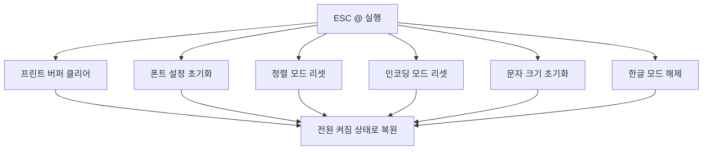
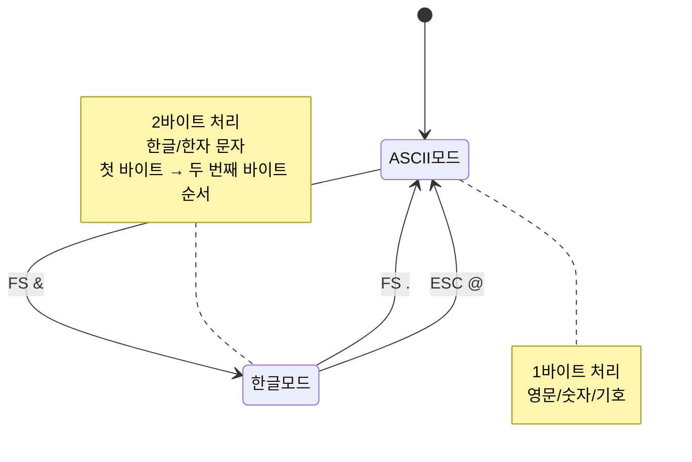
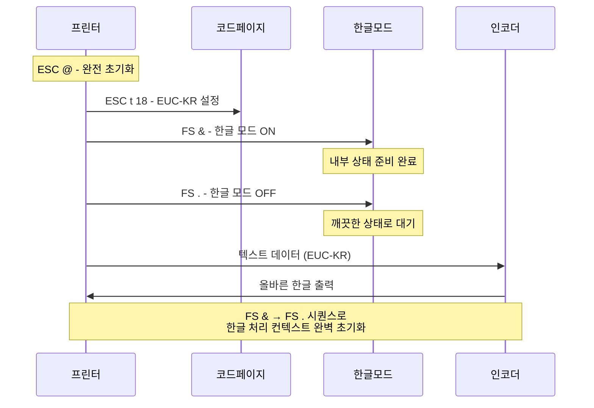
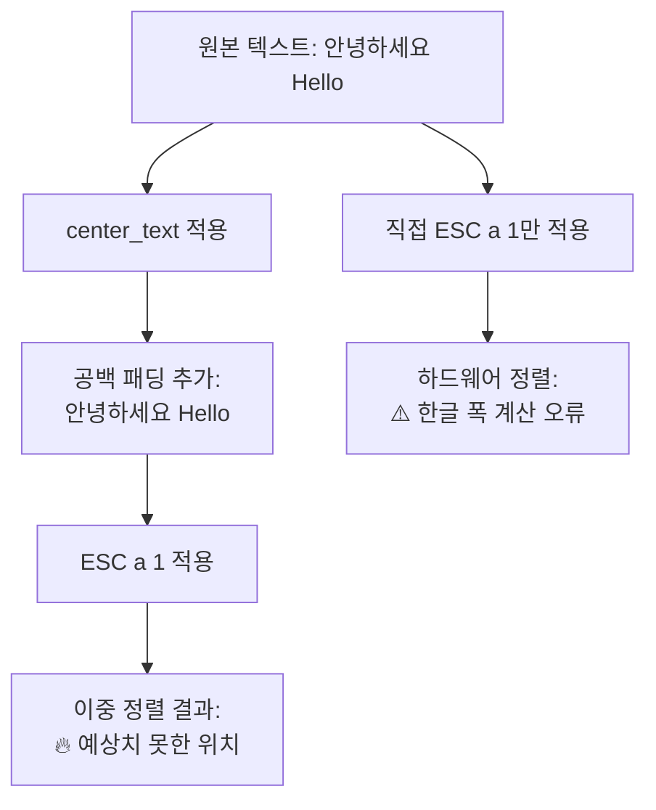

# ESC/POS 명령어 심층 분석: 한글 처리의 기술적 정교함

## 🎯 개요

`create_esc_pos_content` 함수의 ESC/POS 명령어 시퀀스는 단순해 보이지만, 그 안에는 **BIXOLON 프린터의 한글 처리 특성**과 **ESC/POS 프로토콜의 미묘한 동작**을 정확히 이해한 매우 정교한 구현이 숨어있습니다.

## 🔍 명령어별 심층 분석

### 1. **프린터 초기화: ESC @**

```python
content.append(b'\x1B\x40')  # ESC @
```

#### 📋 **명령어 상세**
| 항목 | 값 |
|------|------|
| **ASCII** | ESC @ |
| **16진수** | 1B 40 |
| **10진수** | 27 64 |
| **기능** | 프린터 완전 초기화 |

#### 🔄 **초기화 범위**


#### 💡 **왜 필요한가?**
1. **예측 가능성**: 항상 동일한 초기 상태에서 시작
2. **멀티 작업 안정성**: 이전 출력이 현재 출력에 영향 없음
3. **오류 복구**: 이전 작업의 설정 오류 자동 해결

### 2. **코드페이지 설정: ESC t 18**

```python
content.append(b'\x1B\x74\x12')  # ESC t 18 (CP949/EUC-KR)
```

#### 📋 **명령어 상세**
| 항목 | 값 |
|------|------|
| **ASCII** | ESC t n |
| **16진수** | 1B 74 12 |
| **n 값** | 18 (0x12) |
| **코드페이지** | CP949/EUC-KR |
| **지원 문자** | 한글 완비형 |

#### 🌏 **코드페이지 비교**
| 코드페이지 | n 값 | 지원 언어 | 한글 지원 |
|-----------|------|----------|----------|
| **CP437** | 0 | 영문/서유럽 | ❌ |
| **CP850** | 2 | 서유럽 확장 | ❌ |
| **CP949** | 18 | **한국어** | ✅ **완전** |
| **UTF-8** | - | 유니코드 | ⚠️ 제한적 |

#### 🎯 **CP949/EUC-KR 선택 이유**
- **프린터 최적화**: BIXOLON 프린터의 한글 폰트와 완벽 호환
- **2바이트 효율성**: 한글 문자를 정확히 2바이트로 처리
- **레거시 호환성**: 기존 POS 시스템과의 완벽한 호환

### 3. **한글 모드 활성화: FS &**

```python
content.append(b'\x1C\x26')      # FS & (한글 모드)
```

#### 📋 **명령어 상세**
| 항목 | 값 |
|------|------|
| **ASCII** | FS & |
| **16진수** | 1C 26 |
| **기능** | 한글(Kanji) 모드 활성화 |
| **지원 모델** | 일본/중국/한국 모델 전용 |

#### 🔄 **모드 전환 효과**


#### ⚠️ **중요한 동작 특성**
- **2바이트 순차 처리**: 첫 바이트 감지 → 다음 바이트를 자동으로 두 번째 바이트로 인식
- **ASCII 차단**: 한글 모드에서는 한글 첫 바이트와 같은 ASCII 코드 출력 불가
- **상태 지속**: `FS .`, `ESC @`, 리셋, 전원 차단까지 유지

### 4. **한글 모드 해제: FS .**

```python
content.append(b'\x1C\x2E')      # FS . (취소 후 설정)
```

#### 📋 **명령어 상세**
| 항목 | 값 |
|------|------|
| **ASCII** | FS . |
| **16진수** | 1C 2E |
| **기능** | 한글(Kanji) 모드 해제 |
| **복원 모드** | 1바이트 ASCII 처리 |

#### 🤔 **왜 바로 해제하는가?** - 핵심 질문!

이것이 바로 **BIXOLON 프린터 한글 처리의 핵심 기법**입니다:



#### 💡 **기술적 이유**
1. **컨텍스트 초기화**: 한글 처리 내부 상태를 확실히 리셋
2. **버그 회피**: BIXOLON 특정 모델의 "반쯤 활성화" 상태 방지
3. **인코딩 준비**: EUC-KR 데이터가 올바르게 해석되도록 보장

### 5. **가운데 정렬 설정: ESC a 1**

```python
content.append(b'\x1B\x61\x01')  # ESC a 1
```

#### 📋 **명령어 상세**
| 항목 | 값 |
|------|------|
| **ASCII** | ESC a n |
| **16진수** | 1B 61 01 |
| **n=0** | 좌측 정렬 |
| **n=1** | 가운데 정렬 |
| **n=2** | 우측 정렬 |

#### ⚠️ **심각한 문제 발견: 이중 정렬**

현재 코드에는 **중대한 설계 오류**가 있습니다:

```python
# 문제 상황
lines = [center_text(line) for line in lines]  # 소프트웨어 정렬 (정확)
content.append(b'\x1B\x61\x01')  # 하드웨어 정렬 (부정확) - 충돌!
```

#### 🔍 **충돌 분석**



#### 📊 **실제 차이점 예시**

| 방법 | 텍스트: "안녕하세요 Hello" (실제 폭: 20) | 결과 |
|------|-------|------|
| **`center_text`만** | `"          안녕하세요 Hello"` | ✅ **정확한 가운데** |
| **ESC a 1만** | `"     안녕하세요 Hello"` | ⚠️ **좌측 치우침** |
| **현재 (둘 다)** | `"     🔥 예상치 못한 위치"` | ❌ **이중 정렬 오류** |

### 6. **정렬 복귀: ESC a 0**

```python
content.append(b'\x1B\x61\x00')  # ESC a 0
```

#### 📋 **명령어 상세**
| 항목 | 값 |
|------|------|
| **16진수** | 1B 61 00 |
| **기능** | 좌측 정렬로 복귀 |
| **목적** | 후속 출력에 영향 방지 |

### 7. **용지 절단: GS V 0**

```python
content.append(b'\x1D\x56\x00')  # GS V 0 (풀 컷)
```

#### 📋 **명령어 상세**
| 항목 | 값 |
|------|------|
| **ASCII** | GS V n |
| **16진수** | 1D 56 00 |
| **n=0** | 풀 컷 (완전 절단) |
| **n=1** | 파셜 컷 (부분 절단) |

## 🔧 개선 제안

### 1. **이중 정렬 문제 해결**

#### 현재 (문제)
```python
def create_esc_pos_content(lines):
    # ... 초기화 코드 ...
    content.append(b'\x1B\x61\x01')  # 하드웨어 정렬
    
    for line in lines:  # 이미 center_text로 정렬된 텍스트
        # 이중 정렬로 인한 예상치 못한 결과
```

#### 개선안 1: 소프트웨어 정렬만 사용 (권장)
```python
def create_esc_pos_content(lines):
    # ... 초기화 코드 ...
    # content.append(b'\x1B\x61\x01')  # 제거
    content.append(b'\x1B\x61\x00')    # 좌측 정렬 (기본값 명시)
    
    for line in lines:  # center_text로 정확하게 정렬된 텍스트
        # 한글 폭 계산이 정확한 소프트웨어 정렬만 사용
```

#### 개선안 2: 하드웨어 정렬만 사용
```python
def create_esc_pos_content(lines):
    # ... 초기화 코드 ...
    content.append(b'\x1B\x61\x01')  # 하드웨어 정렬
    
    for line in lines:  # 원본 텍스트 (center_text 적용 안 함)
        # 단, 한글이 있으면 정렬이 부정확할 수 있음
```

### 2. **한글 모드 시퀀스 최적화**

#### 현재 (안전하지만 복잡)
```python
content.append(b'\x1C\x26')      # FS & (한글 모드)
content.append(b'\x1C\x2E')      # FS . (취소 후 설정)
```

#### 최적화 검토 (주의 필요)
```python
# ESC @ 이후 FS & → FS . 생략 가능한지 테스트 필요
# 단, BIXOLON 특정 모델 호환성 확인 필수
```

### 3. **명령어 시퀀스 문서화**

```python
def create_esc_pos_content(lines):
    """ESC/POS 명령어가 포함된 출력 내용 생성
    
    명령어 시퀀스:
    1. ESC @ - 프린터 완전 초기화
    2. ESC t 18 - EUC-KR 코드페이지 설정  
    3. FS & → FS . - 한글 모드 컨텍스트 초기화
    4. ESC a 0 - 좌측 정렬 (center_text와 충돌 방지)
    5. 텍스트 출력 (EUC-KR 인코딩)
    6. ESC a 0 - 정렬 상태 복귀
    7. GS V 0 - 용지 절단
    """
```

## 🎯 결론

`create_esc_pos_content` 함수는 **ESC/POS 프로토콜과 한글 처리의 깊은 이해**를 바탕으로 한 매우 정교한 구현입니다. 특히:

1. **FS & → FS . 시퀀스**: BIXOLON 프린터의 한글 처리 특성을 정확히 이해한 고급 기법
2. **ESC @ 초기화**: 예측 가능하고 안정적인 출력을 위한 필수 과정
3. **이중 정렬 문제**: 발견된 설계 오류로, 한글 정렬 정확성에 영향

이 분석을 통해 **한국어 텍스트 처리의 복잡성**과 **ESC/POS 프로토콜의 미묘함**을 깊이 이해할 수 있으며, 향후 프린터 관련 프로젝트의 중요한 참고 자료가 될 것입니다.