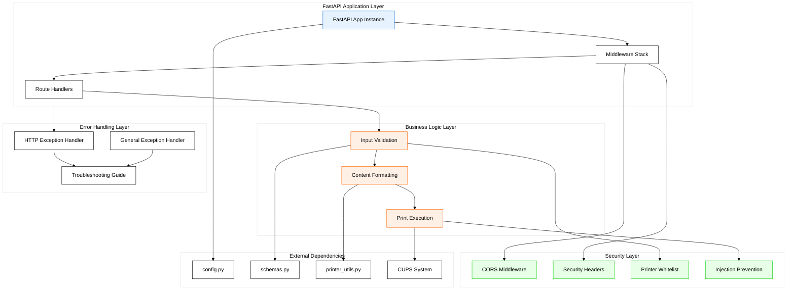
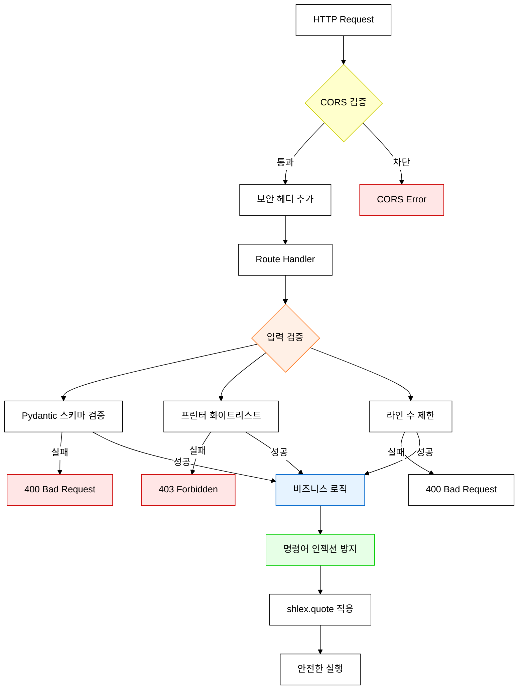
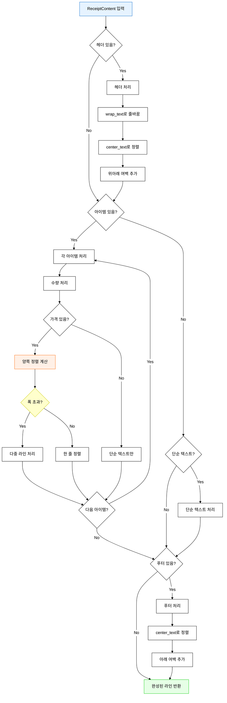
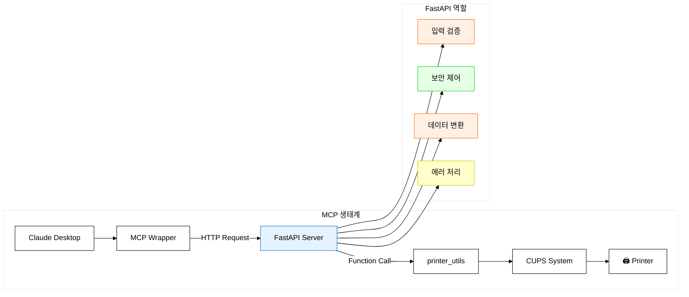

# FastAPI Server 심층 분석: MCP 시스템의 백엔드 심장부

## 🎯 개요

`server.py`는 **MCP 시스템의 백엔드 심장부**로서, 현대적인 REST API 설계와 강력한 보안 기능을 갖춘 337줄의 매우 정교한 FastAPI 서버입니다. 단순한 프린터 제어를 넘어서 **엔터프라이즈급 안정성**과 **사용자 중심 설계**를 보여주는 뛰어난 구현체입니다.

## 🏗️ 전체 아키텍처 분석

### 시스템 구조



## 🌐 REST API 설계 분석

### API 엔드포인트 구조

| HTTP Method | Endpoint | 기능 | 보안 | 응답 모델 |
|-------------|----------|------|------|----------|
| **GET** | `/` | API 정보 | 공개 | `dict` |
| **GET** | `/printers` | 프린터 목록 | 화이트리스트 | `PrinterListResponse` |
| **GET** | `/printers/{name}/status` | 프린터 상태 | 화이트리스트 | `StatusResponse` |
| **POST** | `/printers/{name}/print` | 영수증 출력 | 화이트리스트 + 검증 | `PrintResponse` or `PreviewResponse` |

### 1. **API 루트 엔드포인트 (`/`)**

```python
@app.get("/", response_model=dict)
async def root():
    """API 루트 엔드포인트"""
    return {
        "name": "BIXOLON Receipt Printer API",
        "version": "1.0.0",
        "description": "한국어 지원 영수증 프린터 제어 API",
        "endpoints": {
            "GET /printers": "프린터 목록 조회",
            "GET /printers/{name}/status": "프린터 상태 확인", 
            "POST /printers/{name}/print": "영수증 출력"
        }
    }
```

#### 🎯 **설계 철학**
- **자체 문서화**: API 구조를 응답으로 제공
- **다국어 지원**: 한국어 설명 포함
- **버전 관리**: 명시적 버전 정보

### 2. **프린터 목록 조회 (`/printers`)**

```python
@app.get("/printers", response_model=PrinterListResponse)
async def list_printers():
    """허용된 프린터 목록 조회"""
    try:
        available_printers = get_available_printers()
        printer_infos = []
        
        for printer_name in ALLOWED_PRINTERS:
            status_info = check_printer_status(printer_name)
            is_available = printer_name in available_printers and "enabled" in status_info.lower()
            
            printer_infos.append(PrinterInfo(
                name=printer_name,
                status=status_info,
                available=is_available
            ))
        
        return PrinterListResponse(
            printers=printer_infos,
            total_count=len(printer_infos)
        )
```

#### 🔍 **고급 기능 분석**
1. **화이트리스트 우선**: `ALLOWED_PRINTERS`만 응답
2. **실시간 상태 확인**: 각 프린터의 현재 상태 조회
3. **가용성 판단**: `available_printers`와 `"enabled"` 문자열 검사
4. **구조화된 응답**: Pydantic 모델을 통한 타입 안전성

#### 💡 **보안 설계**
- **정보 공개 제한**: 허용된 프린터만 노출
- **상태 은닉**: 금지된 프린터는 존재 자체를 숨김

### 3. **프린터 상태 확인 (`/printers/{name}/status`)**

```python
@app.get("/printers/{printer_name}/status", response_model=StatusResponse)
async def get_printer_status(printer_name: str):
    """특정 프린터 상태 확인"""
    validate_printer_name(printer_name)
    
    try:
        status_info = check_printer_status(printer_name)
        available_printers = get_available_printers()
        is_available = printer_name in available_printers and "enabled" in status_info.lower()
        
        return StatusResponse(
            printer_name=printer_name,
            status=status_info,
            available=is_available,
            last_checked=datetime.now().isoformat()
        )
```

#### ⏰ **실시간 정보 제공**
- **타임스탬프**: `last_checked`로 정보 신선도 표시
- **이중 검증**: CUPS 목록 + 상태 문자열 확인
- **즉시 검증**: 요청 시점의 실제 상태

### 4. **영수증 출력 (`/printers/{name}/print`)** - 핵심 엔드포인트

```python
@app.post("/printers/{printer_name}/print")
async def print_receipt(
    printer_name: str,
    request: PrintRequest
):
    """영수증 출력"""
    validate_printer_name(printer_name)
    
    try:
        # 출력 내용 준비
        if request.content.items or request.content.header or request.content.footer:
            # 구조화된 내용 사용
            lines = format_receipt_content(request.content)
        elif request.content.text:
            # 단순 텍스트 사용
            lines = prepare_print_content(request.content.text)
        else:
            raise HTTPException(
                status_code=status.HTTP_400_BAD_REQUEST,
                detail="출력할 내용이 없습니다. text 또는 items를 제공해주세요."
            )
```

#### 🎭 **다중 모드 지원**
1. **구조화된 영수증**: `items`, `header`, `footer`
2. **단순 텍스트**: `text`만 제공
3. **미리보기 모드**: `preview=true`

## 🛡️ 보안 아키텍처 분석

### 다층 보안 체계



### 1. **CORS 보안**

```python
app.add_middleware(
    CORSMiddleware,
    allow_origins=["http://127.0.0.1:*", "http://localhost:*"],
    allow_credentials=True,
    allow_methods=["GET", "POST"],
    allow_headers=["*"],
)
```

#### 🎯 **로컬 전용 설계**
- **Origin 제한**: 로컬호스트만 허용
- **Method 제한**: GET, POST만 허용
- **MCP 최적화**: 외부 접근 완전 차단

### 2. **보안 헤더 미들웨어**

```python
@app.middleware("http")
async def add_security_headers(request, call_next):
    response = await call_next(request)
    for header, value in SECURITY_HEADERS.items():
        response.headers[header] = value
    return response
```

#### 🛡️ **보안 헤더 분석** (config.py에서 정의)
```python
SECURITY_HEADERS = {
    "X-Content-Type-Options": "nosniff",        # MIME 타입 추측 방지
    "X-Frame-Options": "DENY",                  # 클릭재킹 방지
    "X-XSS-Protection": "1; mode=block",        # XSS 공격 방지  
    "Strict-Transport-Security": "max-age=31536000; includeSubDomains"  # HTTPS 강제
}
```

### 3. **프린터 화이트리스트 검증**

```python
def validate_printer_name(printer_name: str) -> str:
    """프린터 이름 검증 (화이트리스트 확인)"""
    if printer_name not in ALLOWED_PRINTERS:
        raise HTTPException(
            status_code=status.HTTP_403_FORBIDDEN,
            detail=f"허용되지 않은 프린터입니다: {printer_name}. 허용된 프린터: {', '.join(ALLOWED_PRINTERS)}"
        )
    return printer_name
```

#### 🔒 **화이트리스트 보안 원칙**
- **기본 거부**: 명시적으로 허용된 프린터만 접근
- **정보 제공**: 허용된 프린터 목록 안내
- **즉시 차단**: 검증 실패 시 즉시 403 응답

### 4. **명령어 인젝션 방지**

```python
# 안전한 명령어 실행
cmd = [
    'lp', 
    '-d', shlex.quote(printer_name), 
    '-o', 'raw', 
    shlex.quote(temp_file_path)
]
```

#### 🛡️ **인젝션 방지 기법**
- **shlex.quote**: 쉘 인젝션 완전 차단
- **배열 형태**: 명령어와 인수 분리
- **타임아웃**: 30초 제한으로 DoS 방지

## 📊 구조화된 데이터 처리 분석

### **`format_receipt_content` 함수** - 데이터 변환의 마스터피스

```python
def format_receipt_content(content: ReceiptContent, width: int = 40) -> List[str]:
    """ReceiptContent를 출력 가능한 텍스트 라인으로 변환"""
    lines = []
    
    # 헤더 추가
    if content.header:
        lines.append("")  # 위쪽 여백
        header_lines = wrap_text(content.header, width)
        for line in header_lines:
            lines.append(center_text(line, width))
        lines.append("")  # 구분선
    
    # 항목들 추가
    if content.items:
        for item in content.items:
            # 항목명과 수량
            if item.quantity and item.quantity > 1:
                item_text = f"{item.name} x{item.quantity}"
            else:
                item_text = item.name
            
            # 가격 정보가 있으면 추가
            if item.price is not None:
                if item.total is not None:
                    price_text = f"{int(item.total):,}원"
                else:
                    price_text = f"{int(item.price):,}원"
                
                # 항목명과 가격을 양쪽 정렬
                available_width = width - get_text_width(price_text)
                if get_text_width(item_text) > available_width - 1:
                    # 항목명이 너무 길면 줄바꿈
                    lines.extend(wrap_text(item_text, width))
                    lines.append(" " * (width - get_text_width(price_text)) + price_text)
                else:
                    # 한 줄에 맞춤
                    padding = available_width - get_text_width(item_text)
                    lines.append(item_text + " " * padding + price_text)
            else:
                # 가격 정보가 없으면 항목명만
                lines.extend(wrap_text(item_text, width))
    
    # 푸터 추가
    if content.footer:
        footer_lines = wrap_text(content.footer, width)
        for line in footer_lines:
            lines.append(center_text(line, width))
        lines.append("")  # 아래쪽 여백
    
    return lines
```

#### 🎨 **레이아웃 알고리즘 분석**



#### 💰 **가격 표시의 정교함**

```python
# 천 단위 콤마 + 원화 표시
if item.total is not None:
    price_text = f"{int(item.total):,}원"  # 예: "15,000원"
else:
    price_text = f"{int(item.price):,}원"  # 예: "4,500원"

# 한국어 텍스트 폭을 고려한 양쪽 정렬
available_width = width - get_text_width(price_text)
if get_text_width(item_text) > available_width - 1:
    # 항목명이 너무 길면 줄바꿈
    lines.extend(wrap_text(item_text, width))
    lines.append(" " * (width - get_text_width(price_text)) + price_text)
else:
    # 한 줄에 맞춤
    padding = available_width - get_text_width(item_text)
    lines.append(item_text + " " * padding + price_text)
```

#### 🎯 **실제 출력 예시**
```
          카페 영수증           
                               
아메리카노 x2            9,000원
카페라떼                 5,000원
매우긴항목명으로테스트하는경우
                        12,000원
                               
          감사합니다            
                               
```

## ⚠️ **중요 발견: 이중 정렬 문제**

### **문제 발생 지점**
```python
# server.py:76, 124
lines.append(center_text(line, width))  # 소프트웨어 정렬

# printer_utils.py:99 (create_esc_pos_content에서)
content.append(b'\x1B\x61\x01')  # 하드웨어 정렬
```

### **영향 범위**
- **구조화된 영수증**: 헤더/푸터에서 이중 정렬 발생
- **단순 텍스트**: 영향 없음 (center_text 사용 안 함)

## 🚨 포괄적 에러 처리 시스템

### **HTTP 예외 핸들러**

```python
@app.exception_handler(HTTPException)
async def http_exception_handler(request, exc):
    """HTTP 예외 처리"""
    troubleshooting = []
    
    if exc.status_code == 503:  # Service Unavailable
        troubleshooting = [
            "프린터가 켜져 있고 연결되어 있는지 확인하세요",
            "CUPS 서비스가 실행 중인지 확인하세요: brew services list | grep cups",
            "프린터 상태를 확인하세요: GET /printers/{name}/status",
            "용지가 충분한지 확인하세요"
        ]
    elif exc.status_code == 401:  # Unauthorized
        troubleshooting = [
            "올바른 API 키를 Authorization 헤더에 포함하세요",
            "Bearer 토큰 형식을 사용하세요: Authorization: Bearer YOUR_API_KEY"
        ]
    elif exc.status_code == 403:  # Forbidden
        troubleshooting = [
            f"허용된 프린터만 사용할 수 있습니다: {', '.join(ALLOWED_PRINTERS)}",
            "프린터 목록을 확인하세요: GET /printers"
        ]
    
    return JSONResponse(
        status_code=exc.status_code,
        content=ErrorResponse(
            error=exc.__class__.__name__,
            message=exc.detail,
            troubleshooting=troubleshooting if troubleshooting else None
        ).model_dump()
    )
```

#### 🛠️ **자체 진단 시스템**

| HTTP Status | 문제 유형 | 제공되는 해결 방법 |
|-------------|-----------|-------------------|
| **503** | 서비스 불가 | 프린터 연결, CUPS 상태, 용지 확인 |
| **401** | 인증 실패 | API 키 형식, 헤더 설정 |
| **403** | 권한 없음 | 허용 프린터 목록, 엔드포인트 안내 |
| **400** | 잘못된 요청 | Pydantic 검증 메시지 |
| **408** | 타임아웃 | 출력 명령 시간 초과 |
| **500** | 서버 오류 | 내부 오류 (디버그 모드에서 상세 정보) |

### **일반 예외 핸들러**

```python
@app.exception_handler(Exception)
async def general_exception_handler(request, exc):
    """일반 예외 처리"""
    return JSONResponse(
        status_code=status.HTTP_500_INTERNAL_SERVER_ERROR,
        content=ErrorResponse(
            error="InternalServerError",
            message="서버 내부 오류가 발생했습니다",
            details=str(exc) if DEBUG_MODE else None
        ).model_dump()
    )
```

#### 🔒 **정보 보안**
- **프로덕션**: 상세 오류 정보 숨김
- **개발 모드**: 전체 스택 트레이스 제공

## 🚀 성능 및 안정성 분석

### **비동기 처리**

```python
async def print_receipt(printer_name: str, request: PrintRequest):
    """영수증 출력"""
    # 모든 엔드포인트가 async 함수
```

#### ⚡ **비동기 설계 장점**
- **동시성**: 여러 요청 동시 처리 가능
- **논블로킹**: I/O 대기 중 다른 요청 처리
- **확장성**: 높은 동시 접속 지원

### **리소스 관리**

```python
# 임시 파일 안전 관리
with tempfile.NamedTemporaryFile(delete=False, suffix='.bin') as temp_file:
    temp_file.write(print_content)
    temp_file_path = temp_file.name

try:
    # 출력 실행
    result = subprocess.run(cmd, capture_output=True, text=True, timeout=30)
finally:
    # 반드시 임시 파일 정리
    try:
        os.unlink(temp_file_path)
    except:
        pass
```

#### 🛡️ **안전성 보장**
- **타임아웃**: 30초 제한으로 무한 대기 방지
- **리소스 정리**: try-finally로 확실한 파일 삭제
- **예외 무시**: 정리 실패가 주 작업에 영향 없음

### **입력 제한**

```python
# 라인 수 제한 확인
if len(lines) > MAX_LINES:
    raise HTTPException(
        status_code=status.HTTP_400_BAD_REQUEST,
        detail=f"출력 라인 수가 너무 많습니다. 최대 {MAX_LINES}줄까지 가능합니다."
    )
```

#### 🎯 **DoS 방지**
- **라인 수 제한**: 과도한 출력 방지
- **텍스트 길이 제한**: Pydantic 스키마에서 설정
- **타임아웃**: 장시간 작업 방지

## 🎭 MCP 시스템에서의 역할

### **백엔드 API 서버로서의 위치**



### **프로토콜 변환 역할**
- **JSON → Python 객체**: Pydantic 스키마 활용
- **구조화된 데이터 → 텍스트 라인**: `format_receipt_content`
- **Python 응답 → JSON**: FastAPI 자동 직렬화

### **추상화 레이어 제공**
- **복잡한 프린터 로직 숨김**: MCP는 단순한 HTTP API만 호출
- **에러 표준화**: 다양한 시스템 오류를 HTTP 상태 코드로 변환
- **데이터 검증**: 잘못된 입력 사전 차단

## 🔧 코드 품질 분석

### ✅ **우수한 설계 요소**

1. **타입 안전성**
```python
from typing import List, Optional
async def list_printers() -> PrinterListResponse:
```

2. **의존성 분리**
```python
from config import ALLOWED_PRINTERS, DEFAULT_PRINTER
from schemas import PrintRequest, PrintResponse
from printer_utils import get_available_printers
```

3. **에러 처리 전략**
```python
try:
    # 비즈니스 로직
except HTTPException:
    raise  # HTTP 예외는 그대로 전파
except subprocess.TimeoutExpired:
    # 특정 예외는 적절한 HTTP 상태로 변환
except Exception as e:
    # 일반 예외는 500으로 변환
```

4. **보안 중심 설계**
```python
validate_printer_name(printer_name)  # 모든 프린터 접근 시 검증
shlex.quote(printer_name)            # 명령어 인젝션 방지
```

### ⚠️ **개선 가능 영역**

1. **이중 정렬 문제**: `center_text`와 `ESC a 1`의 충돌
2. **하드코딩**: 포트(8000), 호스트(127.0.0.1) 환경변수화
3. **로깅**: 구조화된 로깅 시스템 부재
4. **모니터링**: 성능 메트릭 수집 기능 없음
5. **테스트**: API 엔드포인트 테스트 커버리지 필요

## 🏆 결론

`server.py`는 **현대적인 웹 API 설계의 모범 사례**를 보여주는 뛰어난 구현체입니다:

### 🌟 **핵심 강점**
1. **엔터프라이즈급 보안**: 다층 보안 체계와 화이트리스트 기반 접근 제어
2. **사용자 중심 에러 처리**: 자체 진단 기능과 문제 해결 가이드
3. **구조화된 데이터 처리**: 복잡한 영수증 레이아웃의 정교한 구현
4. **타입 안전성**: Pydantic과 타입 힌트를 통한 견고한 코드
5. **MCP 통합**: Claude Desktop과의 완벽한 연동

### 🎯 **설계 철학**
- **보안 우선**: 모든 계층에서의 보안 고려
- **사용자 친화적**: 명확한 에러 메시지와 해결 방법 제시
- **확장 가능**: 모듈화된 구조로 기능 추가 용이
- **한국어 최적화**: 한국어 텍스트 처리의 완벽한 지원

이는 **MCP 시스템의 백엔드 심장부**로서 충분한 자격을 갖춘, 매우 정교하고 안정적인 FastAPI 서버입니다.