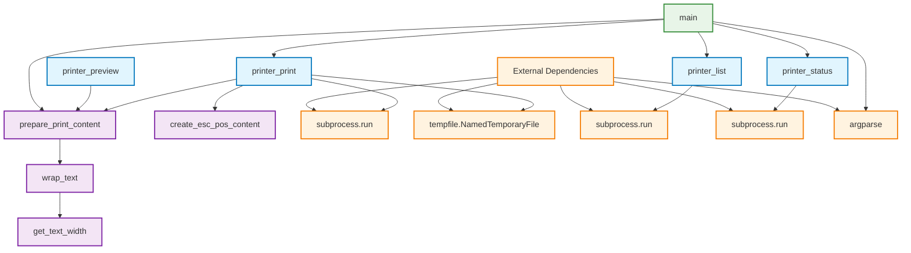
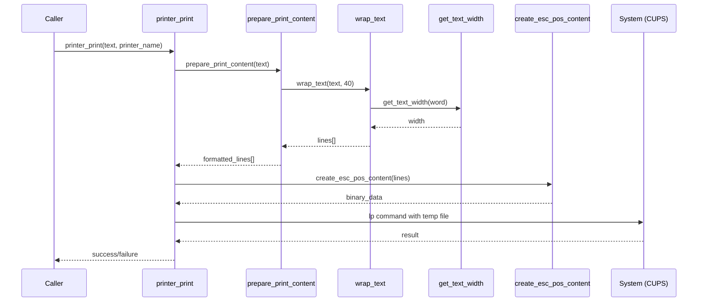
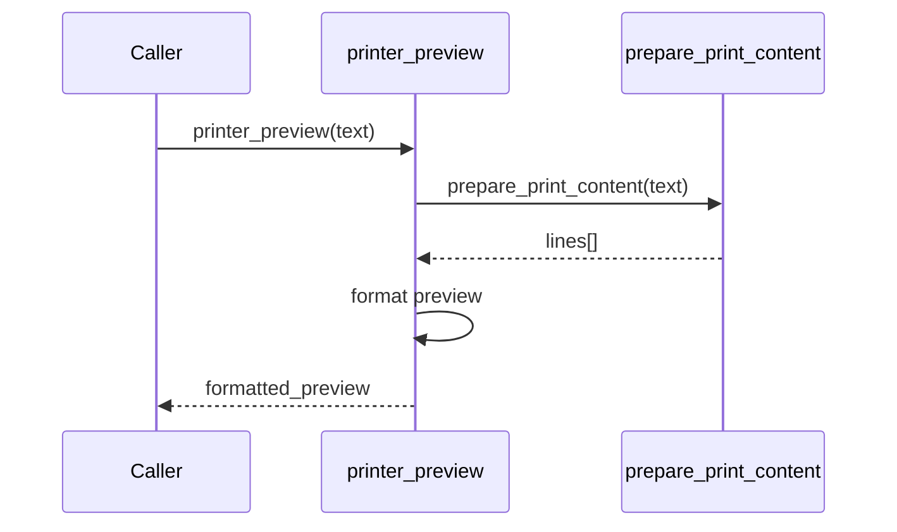

# printer.py 함수 분석 문서

**Created:** 2025-01-07T10:30:00Z  
**Category:** technical

## 개요

`printer.py`는 BIXOLON SRP-330II 영수증 프린터를 위한 핵심 모듈로, 한글 지원과 ESC/POS 프로토콜을 통한 텍스트 출력 기능을 제공합니다.

## 함수 분류

### 🔧 Public API 함수 (외부 호출용)

#### `printer_print(text, printer_name="BIXOLON_SRP_330II")`
- **역할**: 메인 출력 함수 - 텍스트를 영수증으로 출력
- **매개변수**:
  - `text`: 출력할 텍스트
  - `printer_name`: 프린터 이름 (기본값: BIXOLON_SRP_330II)
- **반환값**: `bool` - 출력 성공 여부
- **사용처**: MCP wrapper, CLI
- **특징**: 
  - 임시 파일 생성 및 자동 정리
  - CUPS `lp` 명령어 사용
  - 한글 지원 ESC/POS 바이너리 출력

#### `printer_list()`
- **역할**: 사용 가능한 프린터 목록 조회
- **매개변수**: 없음
- **반환값**: `List[str]` - 프린터 이름 목록
- **사용처**: MCP wrapper, CLI
- **특징**: CUPS `lpstat -p` 명령어 사용

#### `printer_status(printer_name)`
- **역할**: 특정 프린터의 상태 확인
- **매개변수**:
  - `printer_name`: 확인할 프린터 이름
- **반환값**: `str` - 프린터 상태 메시지
- **사용처**: MCP wrapper, CLI
- **특징**: CUPS `lpstat -p [printer]` 명령어 사용

#### `printer_preview(text)`
- **역할**: 출력 미리보기 생성
- **매개변수**:
  - `text`: 미리보기할 텍스트
- **반환값**: `str` - 포맷된 미리보기 텍스트
- **사용처**: MCP wrapper
- **특징**: `prepare_print_content()` 래퍼 함수

### 🔨 Helper 함수 (내부 처리용)

#### `get_text_width(text)`
- **역할**: 텍스트의 실제 출력 폭 계산
- **매개변수**:
  - `text`: 폭을 계산할 텍스트
- **반환값**: `int` - 텍스트 폭 (한글=2, 영문=1)
- **사용처**: `wrap_text()` 함수
- **특징**: 한글/영문 혼용 텍스트의 정확한 폭 계산

#### `wrap_text(text, max_width=40)`
- **역할**: 텍스트를 지정된 폭으로 단어 단위 줄바꿈
- **매개변수**:
  - `text`: 줄바꿈할 텍스트
  - `max_width`: 최대 폭 (기본값: 40)
- **반환값**: `List[str]` - 줄바꿈된 텍스트 리스트
- **사용처**: `prepare_print_content()` 함수
- **특징**: 단어 경계 인식 및 한글 폭 고려

#### `prepare_print_content(text, min_lines=6)`
- **역할**: 출력용 텍스트 포맷팅 (여백 추가)
- **매개변수**:
  - `text`: 포맷팅할 텍스트
  - `min_lines`: 최소 줄 수 (기본값: 6)
- **반환값**: `List[str]` - 포맷된 텍스트 리스트
- **사용처**: `printer_print()`, `printer_preview()`, CLI
- **특징**: 
  - 상하 여백 자동 추가
  - 텍스트 줄 수에 따른 여백 조정

#### `create_esc_pos_content(lines)`
- **역할**: ESC/POS 바이너리 명령어 생성
- **매개변수**:
  - `lines`: 텍스트 줄 리스트
- **반환값**: `bytes` - ESC/POS 바이너리 데이터
- **사용처**: `printer_print()` 함수
- **특징**:
  - 프린터 초기화 명령어
  - 한글 지원 코드페이지 설정 (EUC-KR)
  - 가운데 정렬 및 용지 절단 명령어

### 🖥️ CLI 함수

#### `main()`
- **역할**: 명령행 인터페이스 진입점
- **매개변수**: 명령행 인자 (argparse)
- **반환값**: 없음
- **사용처**: 직접 실행 시 (`python3 printer.py`)
- **특징**:
  - 다양한 CLI 옵션 지원
  - 모든 Public API 함수 호출 가능

## 함수 의존성 다이어그램



## 함수 호출 흐름

### 1. 텍스트 출력 흐름 (`printer_print`)


### 2. 미리보기 흐름 (`printer_preview`)


## 모듈 특징

### 🌏 한글 지원
- **문자 폭 계산**: 한글 2자, 영문 1자로 정확한 레이아웃
- **인코딩**: EUC-KR 우선, UTF-8 폴백
- **ESC/POS 명령어**: 한글 모드 활성화 (`\x1C\x26`)

### 🔧 ESC/POS 프로토콜
- **프린터 초기화**: `ESC @`
- **코드페이지 설정**: `ESC t 18` (CP949/EUC-KR)
- **텍스트 정렬**: 가운데 정렬 후 좌측 복귀
- **용지 절단**: `GS V 0` (풀 컷)

### 📋 에러 처리
- **예외 처리**: 모든 시스템 호출에 try-catch
- **사용자 친화적 메시지**: 한글 에러 메시지
- **리소스 정리**: 임시 파일 자동 삭제

### 🔄 통합성
- **MCP 호환**: 4개 Public API 함수 제공
- **CLI 지원**: 독립 실행 가능한 명령행 도구
- **모듈 재사용**: 각 함수의 독립적 설계

## 사용 예시

### Public API 호출
```python
import printer

# 텍스트 출력
success = printer.printer_print("안녕하세요", "BIXOLON_SRP_330II")

# 프린터 목록 조회
printers = printer.printer_list()

# 프린터 상태 확인
status = printer.printer_status("BIXOLON_SRP_330II")

# 미리보기 생성
preview = printer.printer_preview("테스트 메시지")
```

### CLI 사용
```bash
# 기본 출력
python3 printer.py "출력할 텍스트"

# 미리보기
python3 printer.py "텍스트" --preview

# 프린터 목록
python3 printer.py --list-printers

# 프린터 상태
python3 printer.py --status -p PRINTER_NAME
```

## 확장 가능성

### 추가 가능한 기능
1. **이미지 출력**: ESC/POS 이미지 명령어 지원
2. **바코드 생성**: 1D/2D 바코드 출력
3. **레이아웃 템플릿**: 사전 정의된 출력 형식
4. **프린터 설정**: 농도, 속도 등 세부 설정

### 성능 최적화
1. **연결 풀링**: 프린터 연결 재사용
2. **배치 처리**: 여러 문서 일괄 출력
3. **비동기 처리**: 대용량 출력 시 비동기 지원

---

> **참고**: 본 문서는 printer.py 버전 기준으로 작성되었으며, 함수명이 `printer_` 접두사로 통일된 최신 버전을 반영합니다.